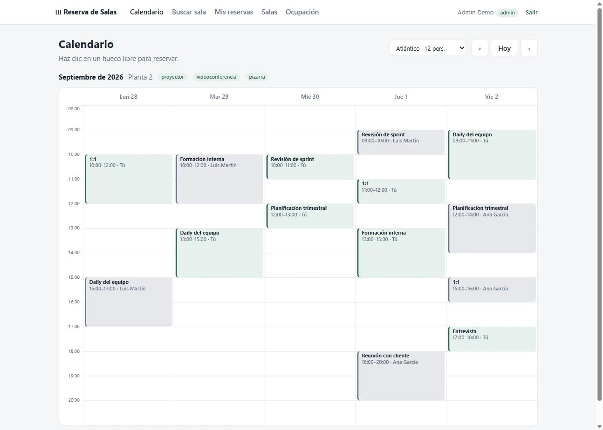
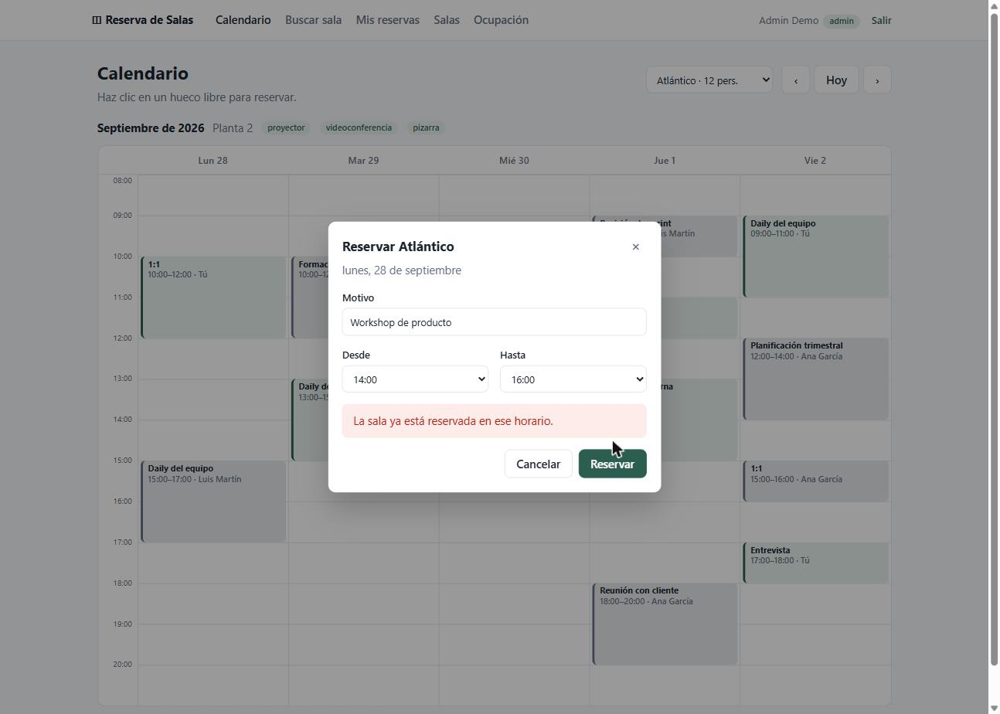
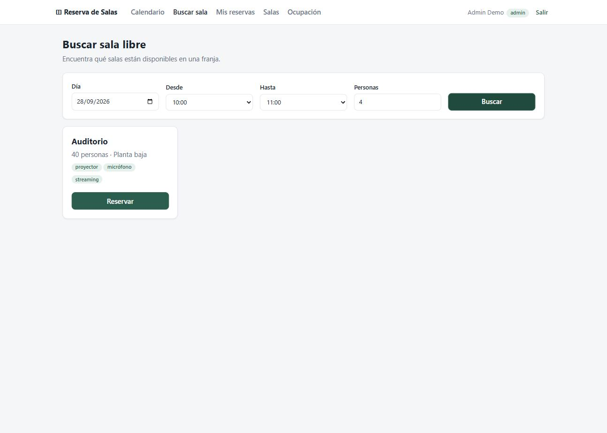
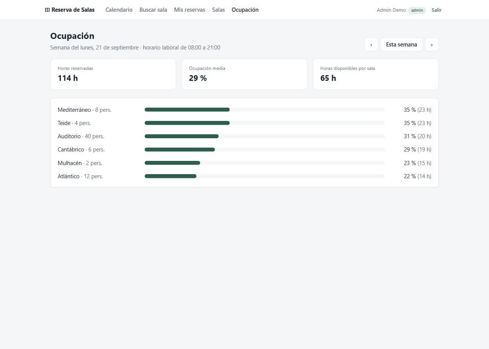

# Reserva de Salas · Flask + PostgreSQL + React

[](https://github.com/jimmyrom1/room-booking/actions/workflows/ci.yml)

Sistema de reserva de salas de reuniones para una oficina o coworking. Incluye login con JWT,
calendario semanal, buscador de salas libres, gestión de salas para administradores y
estadísticas de ocupación. La garantía central la da PostgreSQL: **dos reservas de la misma
sala nunca pueden solaparse**, ni siquiera si llegan a la vez.



| Solapamiento rechazado por la base de datos | Buscador de salas libres | Ocupación (admin) |
| --- | --- | --- |
|  |  |  |

## Stack

| Capa | Tecnología |
| --- | --- |
| API | Python 3.12, Flask 3, SQLAlchemy 2, Marshmallow, Flask-JWT-Extended |
| Base de datos | PostgreSQL 16 (`EXCLUDE USING gist`, `tstzrange`, `btree_gist`), Alembic |
| Frontend | React 19, TypeScript, Vite, React Router |
| Calidad | pytest (57 tests contra PostgreSQL real), Vitest + Testing Library, Ruff, oxlint |
| Infraestructura | Docker Compose (Postgres + Gunicorn + Nginx), GitHub Actions |

## Arrancar en un minuto

```bash
docker compose up --build
```

Abre <http://localhost:8080> y entra con un usuario de demo (contraseña `demo1234`):

| Usuario | Rol |
| --- | --- |
| `admin@demo.local` | Administrador: gestiona salas y ve la ocupación |
| `ana@demo.local`, `luis@demo.local` | Usuarios normales |

## Decisiones técnicas

### Las reservas no se solapan: lo garantiza PostgreSQL

La forma habitual (e incorrecta) es comprobar primero si el hueco está libre y después insertar.
Entre esas dos consultas otra petición puede colarse y acabar con dos reservas en el mismo hueco.

Aquí no se comprueba nada antes de insertar. La tabla tiene una *exclusion constraint*:

```sql
ALTER TABLE bookings ADD CONSTRAINT ex_bookings_no_overlap
  EXCLUDE USING gist (
    room_id WITH =,
    tstzrange(starts_at, ends_at, '[)') WITH &&
  ) WHERE (cancelled_at IS NULL);
```

- `room_id WITH =` y `rango WITH &&`: no puede haber dos filas con la misma sala **y** rangos que
  se solapen.
- `'[)'` es un rango semiabierto, así que una reunión de 10:00 a 11:00 y otra de 11:00 a 12:00 no
  chocan.
- `WHERE cancelled_at IS NULL`: las reservas canceladas no ocupan el hueco.
- `btree_gist` permite mezclar el `=` de un entero con el `&&` de un rango en el mismo índice GiST.

Cuando se viola, PostgreSQL lanza `ExclusionViolation` y la API responde
`409 {"error": "slot_taken"}`. El test
[`test_no_double_booking_under_concurrency`](backend/tests/test_bookings.py) lanza 16 peticiones
simultáneas por la misma franja y comprueba que exactamente una gana.

### Las fechas y horas siempre llevan zona horaria

- Las columnas son `timestamptz` y la API rechaza fechas sin zona horaria (`AwareDateTime`).
- La conexión con la base de datos se fija en UTC, así que la API responde igual sea cual sea la
  configuración del servidor. Esto salió de un test que pasaba en local (Madrid) y fallaba en la
  CI (UTC).
- Las reglas de horario (08:00–21:00, de lunes a viernes) se evalúan en la zona horaria de la
  oficina (`OFFICE_TIMEZONE`), no en la del servidor.

### Reglas de negocio como funciones puras

[`rules.py`](backend/app/rules.py) no depende de Flask ni de la base de datos: recibe fechas y
devuelve un error por campo. Se aplican estas reglas:

- Tramos de 15 minutos.
- 4 horas como máximo.
- Dentro del horario de la oficina.
- En días laborables.
- Nunca en el pasado.
- Con 60 días de antelación como máximo.

### La ocupación se calcula en SQL

Para cada sala se suman las horas reservadas **recortadas a la ventana consultada**
(`LEAST(fin, :to) - GREATEST(inicio, :from)`), con un `LEFT JOIN` para que salgan también las
salas vacías.

Un detalle que un test destapó: en PostgreSQL, `LEAST` y `GREATEST` **ignoran los NULL**. En las
filas del `LEFT JOIN` sin reserva el cálculo devolvía la ventana entera, así que una sala vacía
aparecía como ocupada al 100 %. Se corrige con `SUM(...) FILTER (WHERE bookings.id IS NOT NULL)`.

### Autenticación

- Las contraseñas se guardan con hash `scrypt` (Werkzeug) y el token JWT dura 8 horas.
- El login devuelve el mismo error tanto si el email no existe como si la contraseña es incorrecta,
  para no revelar qué emails están registrados.
- El primer usuario que se registra es administrador. Así se puede arrancar la aplicación sin tocar
  la base de datos a mano.
- Las salas con historial de reservas no se borran, se desactivan. Así se conservan los datos.

### Exportación a calendario (.ics)

*Mis reservas* permite añadir las próximas reservas, todas o una a una, a Google Calendar,
Outlook o Apple Calendar. El archivo lo genera [`ical.py`](backend/app/ical.py), una función pura
que implementa lo necesario de RFC 5545 sin dependencias:

- Las horas van en UTC (`20260928T080000Z`), así que cada calendario las muestra en la zona de
  quien lo abre.
- El `UID` es estable (`booking-7@room-booking`). Si se importa el archivo otra vez, el calendario
  actualiza el evento en lugar de duplicarlo.
- Se escapan `;`, `,`, `\` y los saltos de línea, y las líneas de más de 75 **octetos** se parten
  sin cortar un carácter UTF-8 por la mitad (una `ñ` ocupa dos). Un test lo comprueba con un
  título largo lleno de eñes.
- Cada evento lleva un aviso 15 minutos antes.
- La descarga necesita el token, y un enlace normal no puede enviar `Authorization`. Por eso el
  frontend la pide con `fetch` y entrega el archivo como blob.

## API

Todas las rutas, salvo las de `/api/auth` y `/api/health`, requieren
`Authorization: Bearer <token>`.

| Método | Ruta | Descripción |
| --- | --- | --- |
| `POST` | `/api/auth/register` · `/api/auth/login` | Devuelven `access_token` y el usuario |
| `GET` | `/api/auth/me` | Usuario actual |
| `GET` | `/api/rooms` | Salas; con `?from=&to=` solo las libres. También `?min_capacity=`, `?amenity=` |
| `POST` / `PUT` / `DELETE` | `/api/rooms[/:id]` | Gestión de salas (solo admin) |
| `GET` | `/api/bookings?from=&to=[&room_id=]` | Reservas activas en un rango (calendario) |
| `GET` | `/api/bookings/mine?scope=upcoming\|past` | Mis reservas |
| `GET` | `/api/bookings/mine.ics` · `/api/bookings/:id.ics` | Exportar a calendario (iCalendar) |
| `POST` | `/api/bookings` | Reservar (`409 slot_taken` si el hueco está ocupado) |
| `DELETE` | `/api/bookings/:id` | Cancelar (quien reservó o un admin, y antes de que empiece) |
| `GET` | `/api/stats/occupancy?from=&to=` | Horas y % de ocupación por sala (solo admin) |

```bash
TOKEN=$(curl -s -X POST localhost:8080/api/auth/login -H 'Content-Type: application/json' \
  -d '{"email":"ana@demo.local","password":"demo1234"}' | jq -r .access_token)

curl -X POST localhost:8080/api/bookings -H "Authorization: Bearer $TOKEN" \
  -H 'Content-Type: application/json' \
  -d '{"room_id":1,"title":"Daily","starts_at":"2026-10-05T10:00:00+02:00","ends_at":"2026-10-05T10:30:00+02:00"}'
```

## Desarrollo local (sin Docker)

Requisitos: Python 3.12, Node 20+ y PostgreSQL 13 o superior.

```bash
createuser -P booking                    # contraseña: booking
createdb -O booking booking
createdb -O booking booking_test

cd backend
python -m venv .venv && source .venv/bin/activate   # Windows: .venv\Scripts\activate
pip install -r requirements-dev.txt
cp .env.example .env
flask --app wsgi db upgrade && flask --app wsgi seed
flask --app wsgi run                                 # http://localhost:5000

cd frontend
npm install && npm run dev                           # http://localhost:5173
```

## Tests

```bash
cd backend  && pytest --cov=app   # 57 tests: auth, reglas, concurrencia, estadísticas, .ics
cd frontend && npm test           # fechas, diálogo de reserva y exportación .ics (con fetch simulado)
```

La CI ejecuta en cada push:
1. Backend: lint, tests contra PostgreSQL y la migración de ida y vuelta.
2. Frontend: lint, comprobación de tipos, tests y build.
3. Un smoke test del `docker compose` completo: login, acceso protegido, la restricción `EXCLUDE`
   creada por la migración y el enrutado de la SPA en Nginx.

## Limitaciones conocidas

- El frontend muestra las horas en la zona horaria del navegador. Está pensado para un equipo que
  trabaja en la misma zona que la oficina.
- El token se guarda en `localStorage`. Para producción sería mejor una cookie `HttpOnly` con
  protección CSRF.

## Qué añadiría después

- Reservas recurrentes (cada lunes a las 10:00), con detección de conflictos para toda la serie.
- Invitaciones a otros usuarios.
- Suscripción al calendario por URL (feed `.ics` con un token propio y revocable, porque los
  clientes de calendario no pueden enviar la cabecera `Authorization`).
- Refresh tokens y cookies `HttpOnly`.
- Límite de peticiones en el login.

## Otros proyectos

Forma parte de una serie de proyectos con el mismo enfoque: reglas de negocio garantizadas
por la base de datos o por funciones puras, tests que prueban los casos difíciles y CI en cada push.

| Proyecto | Qué es |
| --- | --- |
| [LoL Tracker API](https://github.com/jimmyrom1/lol-tracker-api) | Backend en Node.js 24 + TypeScript + Fastify: proxy de la API de Riot con caché compartida en PostgreSQL, límite de peticiones y la key solo en el servidor. |
| [LoL Tracker](https://github.com/jimmyrom1/lol-tracker) | App Android nativa: Kotlin, Jetpack Compose, Room, Hilt, multimódulo e importación de partidas desde la API de Riot. |
| [Subscriptions API](https://github.com/jimmyrom1/subscriptions-api) | API REST con Java 21 y Spring Boot 4: prorrateo, facturación idempotente, ShedLock, Flyway y Testcontainers. |
| [Mini Facturas](https://github.com/jimmyrom1/mini-invoice-generator) | Flask + PostgreSQL + React: facturas con IVA por línea, IRPF, numeración correlativa atómica y PDF. |

## Licencia

MIT
